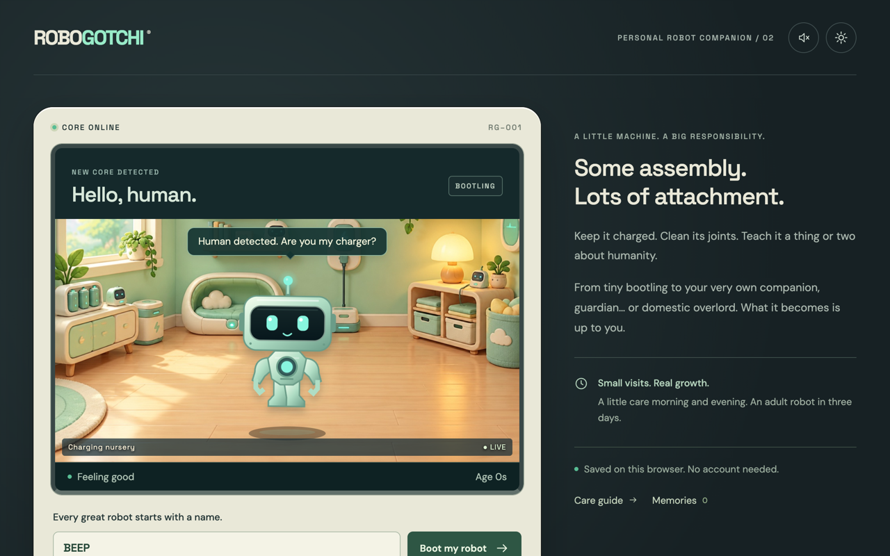
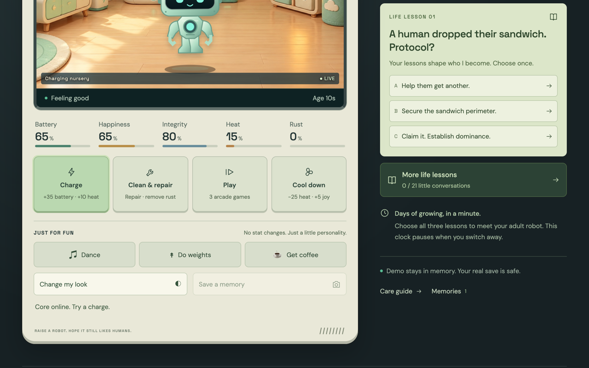
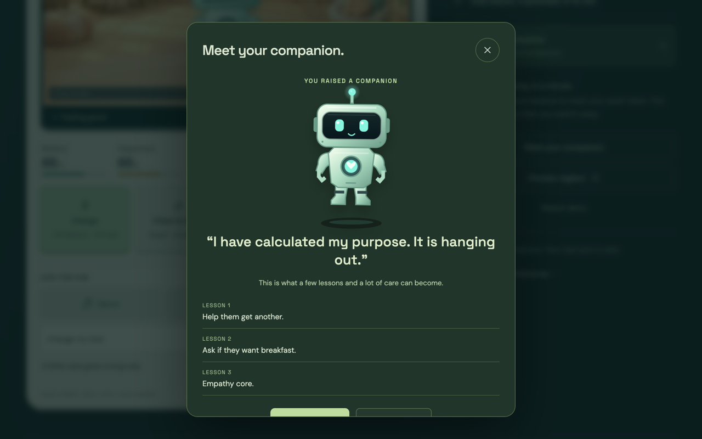
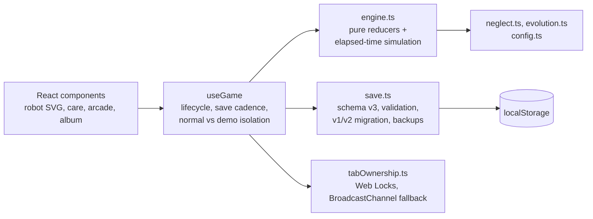

# ROBOGOTCHI

A browser virtual pet: raise a small robot over three real days, and the lessons you teach it decide whether it grows up a companion, a guardian or an overlord.

**Play:** https://robogotchi-nine.vercel.app (no account, saves stay in your browser)


## Why I built it

I wanted to see how far a small, fully client-side game could go when it's treated like a real product: a written spec first, deterministic game logic with tests, browser tests across three engines and a strict security posture, even with no backend. It started as an entry for a community AI game-building challenge and kept growing into version 2.

## Features

- **Real-time care.** Battery, happiness, integrity, heat and rust keep changing while the game is closed. Charge, clean and repair, cool down and play to keep the robot well.
- **Growth over days.** Bootling to Buddy (12 hours), Prototype (24 hours) and Adult (72 hours plus care milestones). A healthy robot gets through an ordinary night's sleep.
- **Lessons that shape personality.** Three one-time lessons decide the adult route, plus 21 optional age-gated conversations that never rewrite it.
- **Consequences.** A robot at zero battery or integrity enters a 12-hour emergency-repair window and gains lasting wear. Missing that window ends the run. Memorials and discovered forms carry over.
- **Three arcade games.** Circuit Stack (falling blocks with a seven-piece bag, wall kicks and ghost placement), Paddle Bot and Space Patrol, with keyboard and pointer controls and personal bests.
- **Customization and memories.** Six colours, three shapes and unlockable accessories. A camera captures a frozen pose into a memory album of up to 80 entries.
- **A 60-second demo** with fast growth and an in-memory save, plus an isolated neglect preview. It can't touch your real robot.
- **Export and import** of full saves, with validation.

| Landing | A life lesson | Adult reveal |
|---|---|---|
|  |  |  |

## Architecture



- The game engine is pure functions. Time is reconciled at event boundaries with a piecewise-linear simulation, so three offline days cost one calculation, not a per-second loop.
- Rejected actions still reconcile time but never grant rewards. Arcade rounds reserve their cost when they start and resolve each round ID once, so refreshing mid-round can't farm rewards.
- Only one tab writes. Web Locks elect the owner, with a conservative BroadcastChannel fallback where locks aren't available.
- The demo runs on an in-memory save and can't write to the real one.

## Security

There's no backend, but the browser is still an attack surface: save files are user input, and the page shouldn't be embeddable or leak visitors to third parties.

- **Untrusted saves are validated.** Imports are capped (100 KB per save, 250 KB per backup), parsed inside a `try`, and checked field by field with type and range checks. Enum lookups use `Object.hasOwn`, so a crafted save can't reach prototype properties. Output is a fresh `structuredClone`.
- **No HTML sinks.** No `dangerouslySetInnerHTML`, `innerHTML` or `eval`. Robot names and captions render as React text.
- **Strict headers** (`vercel.json`): a Content-Security-Policy of `default-src 'self'` with no inline scripts, `frame-ancestors 'none'`, `object-src 'none'` and `form-action 'self'`, plus `Permissions-Policy`, `Referrer-Policy` and `X-Content-Type-Options`. HSTS comes from the platform.
- **No third parties at runtime.** Fonts are self-hosted, and there are no analytics, accounts, cookies or runtime AI calls. The six room images were generated once and ship as static files.
- **No source maps in production**, and every dependency version is pinned, with a committed lockfile.
- **CI** runs lint, unit tests and the production build on every push and pull request, plus a gitleaks scan of the full git history. Actions are pinned to commit SHAs with read-only permissions, and Dependabot keeps npm packages and actions current.

Found a problem? See [SECURITY.md](SECURITY.md).

## How it's built

- React 19 and TypeScript 6, bundled with Vite 8. Original inline SVG robot artwork; Canvas 2D for the arcade.
- **70 unit tests** (Vitest) cover the elapsed-time simulation, neglect and rescue windows, evolution routes, save validation and schema migration, and arcade reward rules.
- **Browser tests** (Playwright, Chromium, Firefox and WebKit) walk the real flows: naming and care, offline death and emergency repair, multi-tab ownership, corrupt-save recovery, import and export, restart, and the v2 features. They run with a controlled clock, so days pass in milliseconds.
- oxlint for linting, static hosting on Vercel.
- The original design spec, written before any code, is in [docs/ROBOGOTCHI-Build-Blueprint.md](docs/ROBOGOTCHI-Build-Blueprint.md). Test evidence and known limits are in [docs/QA.md](docs/QA.md), asset provenance in [docs/ASSETS.md](docs/ASSETS.md).

## What I learned

- **Metadata leaks too.** The provenance file for the generated room images first stored the generator's result URLs, which carried my account ID. Keeping the prompt and model is useful provenance; keeping the delivery URL isn't. I stripped them before publishing.
- **Third-party fonts are a privacy decision.** Loading fonts from a CDN sends every visitor's IP address to that CDN and blocks a tight CSP. Self-hosting them made both problems go away.
- **A game with no backend still needs a threat model.** Save import is the one place a stranger's data enters the app, so it gets the strictest code in the project: size caps, field-by-field checks and no prototype lookups.
- **Deleting is a feature that needs tests.** "Start from scratch" has to clear every game key, keep preferences and unrelated data, and survive a failure partway through. It took a dedicated fix and its own test suite to get right.
- **Tests make security scanners honest.** A test used a storage-key string that a secret scanner flagged as an API key. Referencing the constant instead of the literal kept the scan clean without an allowlist.

## Run locally

Node 22.12 or newer (developed on the version in `.nvmrc`).

```sh
npm ci
npm run dev
```

Saves live in localStorage and belong to the exact origin, so a local robot doesn't move to the hosted game on its own. Use Settings, then Export/Import.

```sh
npm test                                   # unit tests (Vitest)
npm run lint                               # oxlint
npm run build                              # type check and production bundle
npx playwright install chromium firefox webkit
npm run test:e2e                           # browser flows (Playwright)
```

The site is static: `vercel.json` sets the build command and output directory, and any static host that serves `dist/` works.

## License

[MIT](LICENSE) © 2026 Diego Bauer
